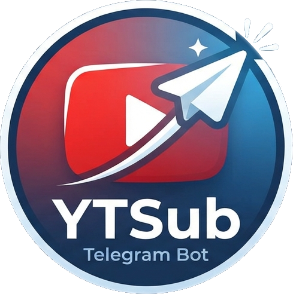

# YTSub Telegram Bot

<p align="center">
  
</p>

A Telegram bot that monitors YouTube subscriptions and sends updates about new video uploads using channel RSS feeds.

Tested on Linux, but can run on any system with Python 3.

## Prerequisites

1. Create a Telegram bot using [BotFather](https://t.me/BotFather) and get the bot's `token`.
2. **Get Google OAuth 2.0 Client ID & Client Secret**:
   - Go to the [Google Cloud Console](https://console.cloud.google.com/).
   - Click the project dropdown at the top and click **New Project** (name it e.g. `YTSub`), then click **Create**.
   - **Enable the YouTube API**:
     - In the left sidebar, navigate to **APIs & Services** > **Library**.
     - Search for `YouTube Data API v3`, click it, and click **Enable**.
   - **Configure the OAuth Consent Screen**:
     - In the left sidebar, click **APIs & Services** > **OAuth consent screen**.
     - Select **External** user type and click **Create**.
     - Fill in **App name** (e.g. `YTSub`), **User support email**, and **Developer contact information** (your email). Click **Save and Continue**.
     - On the **Scopes** page, click **Add or Remove Scopes**. Search for `YouTube Data API v3` (or `youtube.force-ssl`), select the scope `.../auth/youtube.force-ssl` (*See, edit, and permanently delete your YouTube videos, ratings, comments and captions*), click **Update**, then **Save and Continue**.
     - On the **Test users** page, click **+ Add Users**, enter the Google account email address you use for YouTube (and any other users who will connect), then click **Save and Continue**.
     - Click **Back to Dashboard**.
   - **Create OAuth Client Credentials**:
     - In the left sidebar, navigate to **APIs & Services** > **Credentials**.
     - Click **+ Create Credentials** at the top and select **OAuth client ID**.
     - In the **Application type** dropdown, select **Desktop app**.
     - Enter a name (e.g. `YTSub Client`) and click **Create**.
     - A modal will pop up with your **Client ID** and **Client Secret**.
   - Copy these two values into `config.inc.sh`:
     ```bash
     GOOGLE_CLIENT_ID="xxxxxxxxxxxx-xxxxxxxxxxxxxxxx.apps.googleusercontent.com"
     GOOGLE_CLIENT_SECRET="GOCSPX-xxxxxxxxxxxxxxxxxxxxxxxx"
     ```

## Configuration & Running

You can configure the bot via command-line arguments or environment variables.

### Environment variables

- `BOT_TOKEN`: Telegram bot token (required)
- `ADMIN_USERIDS`: Comma-separated list of Telegram admin user IDs (admins receive a startup notification)
- `ALLOWED_USERIDS`: Comma-separated list of allowed Telegram user IDs (if not specified, all users can interact)
- `STATE_FILE`: Path to persistent state file (default: `ytsub-state.json`)
- `CHECK_INTERVAL_SEC`: RSS polling interval in seconds (default: `300` / 5 minutes)
- `SUBSCRIPTION_SYNC_INTERVAL_SEC`: YouTube subscription sync interval in seconds (default: `43200` / 12 hours)
- `MAX_POSTS_PER_MIN`: Max video post notifications sent per minute per user (default: `10`, set to `0` to disable rate limiting)
- `ERROR_ALERT_SEC`: Feed error alert threshold in seconds (default: `21600` / 6 hours, also configurable via `--error-alert-hours` / `ERROR_ALERT_HOURS`)
- `GOOGLE_CLIENT_ID`: Google OAuth Client ID (optional, or put `client_secret.json` in bot directory)
- `GOOGLE_CLIENT_SECRET`: Google OAuth Client Secret (optional)
- `GOOGLE_CLIENT_SECRET_FILE`: Path to `client_secret.json` (auto-detected if `client_secret.json` is in the bot root)

### Running locally

Copy `config.inc.sh-example` to `config.inc.sh` and edit with your parameters:

```bash
cp config.inc.sh-example config.inc.sh
chmod 600 config.inc.sh
```

Then start the bot using `run.sh`:

```bash
./run.sh
```

`run.sh` will automatically create a Python virtual environment in `.venv/` and install all required packages.

### Running with Docker / Container

You can build and run using `buildah` / `podman` or `docker`:

```bash
./01-buildah-image.sh
```

Or with Docker:

```bash
docker build -t nonoo/ytsub-telegram-bot:latest .
docker run -d --name ytsub \
  -e BOT_TOKEN="your-telegram-bot-token" \
  -e ADMIN_USERIDS="123456789" \
  -v $(pwd)/ytsub-state.json:/app/ytsub-state.json \
  nonoo/ytsub-telegram-bot:latest
```

## User Onboarding & Commands

Each authorized user can independently connect their YouTube account and receive notifications only for channels they subscribe to.

1. Send `/start` to the bot.
   - The bot immediately provides an authorization link.
   - Click the link, sign in to your Google account, and grant access to YouTube.
   - Copy the authorization code (or the full redirected URL) from your browser and paste it into the Telegram chat.
   - Once authenticated, the bot automatically downloads your list of subscribed channels.

### Available commands

- `/start`: Connect or re-authenticate your YouTube account via OAuth 2.0. If credentials already exist, prompts for confirmation before redoing the flow.
- `/update`: Refresh and synchronize your subscribed YouTube channels from YouTube Data API v3 (also performed automatically on bot startup and every 12 hours).
- `/custom`: Manage additional custom RSS feeds:
  - `/custom` or `/custom list`: List your configured custom feeds.
  - `/custom add <url_or_channel_id>`: Add a custom RSS feed (supports raw feed URLs, YouTube channel IDs like `UC...`, channel URLs, and playlist URLs). The channel/author name is automatically extracted from the feed.
  - `/custom remove <number_or_url>`: Remove a custom feed by its list number or exact URL.
- `/stop`: Clear your pending notification queue.
- `/reload`: Reload the state from `ytsub-state.json` and perform RSS feed updates on channels updated more than 5 minutes ago (admin only).
- `/status`: Show current tracking status (channels tracked, custom feeds, pending notifications queue, check interval, authentication state, and any feeds with errors sorted by first error timestamp).
- `/help`: Display the list of available commands.

## How it works

1. **Subscription synchronization & quiet initial sync**: The bot automatically synchronizes subscribed channels from the YouTube Data API v3 on application startup and every 12 hours in the background. You can also trigger an on-demand sync at any time using `/update`. When channels or custom feeds are first added, existing videos are not spammed; the current timestamp is recorded in `ytsub-state.json`.
2. **Periodic feed checks**: Every 5 minutes (configurable with `CHECK_INTERVAL_SEC`), the bot checks Atom/RSS feeds for all tracked YouTube channels and custom feeds. Unique feed URLs are polled concurrently and deduplicated.
3. **Persistent outbox & rate-limited delivery**: Detected video notifications are saved to a persistent queue in `ytsub-state.json` and delivered gradually according to `MAX_POSTS_PER_MIN` (default: 10/min per user). If notifications arrive within the rate limit (e.g. 8 videos), they are delivered immediately in a burst. If the bot is stopped for hours or a large backlog accumulates, posts are not lost and will be delivered gradually across rolling 60-second windows without spamming or triggering Telegram rate limits. Users can clear their pending backlog at any time using `/stop`.
4. **Targeted notifications & relative timestamps**: Each video notification displays the channel title in bold (without brackets) and includes a relative timestamp calculated at the time of delivery:
   ```
   {channel_title} https://www.youtube.com/watch?v={video_id} ({time_ago})
   ```
   *(e.g. `Google Developers https://www.youtube.com/watch?v=abcd1234efg (5m ago)` with bold channel name)*
   Sent only to users subscribed to that channel or custom feed.
5. **Watch Later & Listen Later buttons**: Each video notification contains two inline action buttons:
   - `🕒 Watch Later`: Adds the video to your private **`YTSub Watch Later`** playlist on YouTube.
   - `🎧 Listen Later`: Adds the video to your private **`YTSub Listen Later`** playlist on YouTube.

   *(Note: The YouTube Data API does not allow third-party applications to modify YouTube's default system "Watch Later" playlist, which is why a dedicated custom playlist named `YTSub Watch Later` is used instead.)*

   Both playlists are created automatically in your YouTube library if they don't already exist. Clicking a button adds the video, switches the button to a checkmark (`✅ Watch Later` / `✅ Listen Later`), and displays a toast notification. Clicking a checkmarked button removes the video from the playlist and reverts the button back to its initial state.

6. **State persistence**: User access tokens, cached playlist IDs, channel update timestamps, and pending notification queues are persisted atomically to `ytsub-state.json`.
7. **Feed error detection & recovery alerts**: If a feed cannot be fetched or parsed, the start timestamp and latest error are recorded in `ytsub-state.json`. If a feed continuously fails for 6 hours (configurable with `ERROR_ALERT_SEC` / `ERROR_ALERT_HOURS`), it triggers a batched user alert (e.g. `⚠️ Error updating: Feed A, Feed B, ... and 5 more` if more than 10 feeds). Likewise, when a previously alerted feed recovers, it is aggregated into a batched recovery notification (`✅ Working again: Feed A, Feed B, ... and 5 more`).

## Contributors

- Norbert Varga [nonoo@nonoo.hu](mailto:nonoo@nonoo.hu)

## Donations

If you find this bot useful then [buy me a beer](https://paypal.me/ha2non). :)

## License

[MIT](LICENSE)

